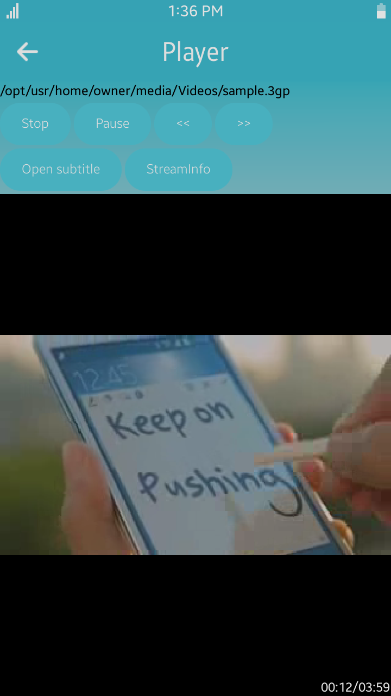

# PlayerSample
This sample application demonstrates how to play an audio or a video and stream it using [Tizen Multimedia API](https://samsung.github.io/TizenFX/stable/api/Tizen.Multimedia.html).

### Prerequisites
* [Visual Studio](https://www.visualstudio.com/) - Buildtool, IDE
* [Visual Studio Tools for Tizen](https://docs.tizen.org/application/vstools/install) - Visual Studio plugin for Tizen .NET application development
