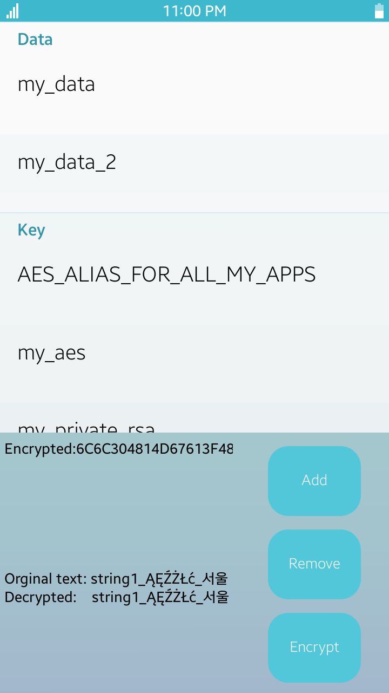
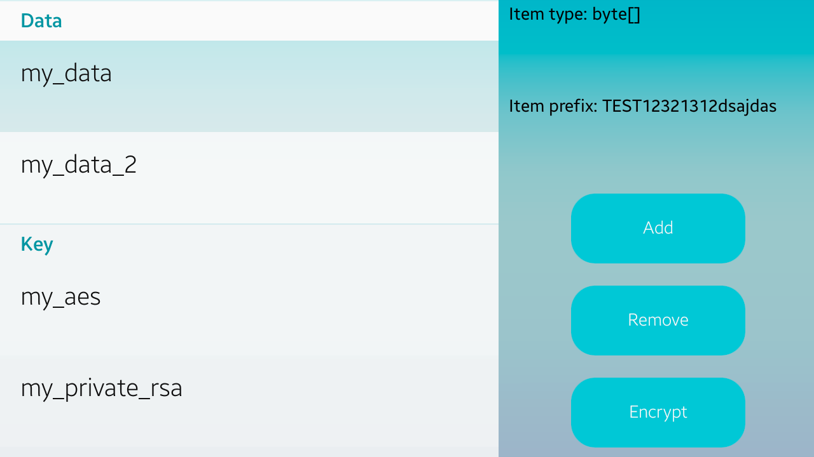
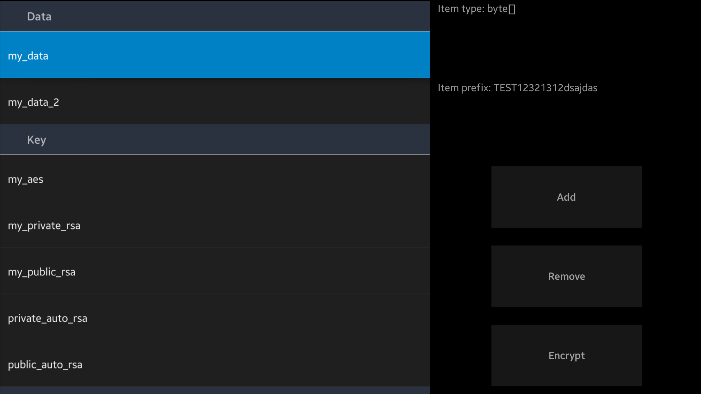
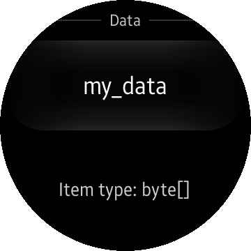

# SecureRepository
## Overview
SecureRepository is a simple application that allows you to securely store data, certificates and cryptographic keys
using C# [Tizen.Security.SecureRepository API](https://samsung.github.io/TizenFX/stable/api/Tizen.Security.SecureRepository.html).

Secure Repository function is provided by [key-manager](https://wiki.tizen.org/Security/Tizen_3.X_Key_Manager) module in Tizen.

Secure Repository app is mainly designed for Tizen TV and Mobile profile however it also runs on Wearable devices but with limited UI.
What`s more it is written in [XAML](https://developer.xamarin.com/guides/xamarin-forms/xaml/).
It has a custom layout and shows how events are processed in the application.
It also uses [DependencyService](https://developer.xamarin.com/guides/xamarin-forms/application-fundamentals/dependency-service/)
and [Binding](https://developer.xamarin.com/guides/xamarin-forms/xaml/xaml-basics/data_binding_basics/).

Please be aware that in production type application you should use longer cryptographic keys.
In sample app the Keys length are intentionally lowered to increase application responsiveness.

## Sample Usage
1. Click Add button to add sample data to key-manager. ListView with items should pop up.
2. Click on item. Label with item type and content prefix should appear.
3. Click remove button to remove data from key-manager. ListView should be cleared.
4. Click encrypt button to add AES-Key to key-manager and them use it to encrypt sample data.
ListView with AES-Key should pop up. First label should show Encrypted text prefix
and the second one text before encryption and after decryption.

> **Note**
>
> Werable UI does not have buttons, therefore application automatically adds sample data
to key-manager.

## Verified Version
* [Xamarin.Forms](https://www.xamarin.com/forms) : 4.5.0
* Tizen.NET : 6.0.0
* Tizen.NET.SDK : 1.0.9

## Supported Profile
* Mobile
* TV
* Wearable

## Author
* Ernest Borowski

## Screenshots
### Mobile

### TV

### Wearable

