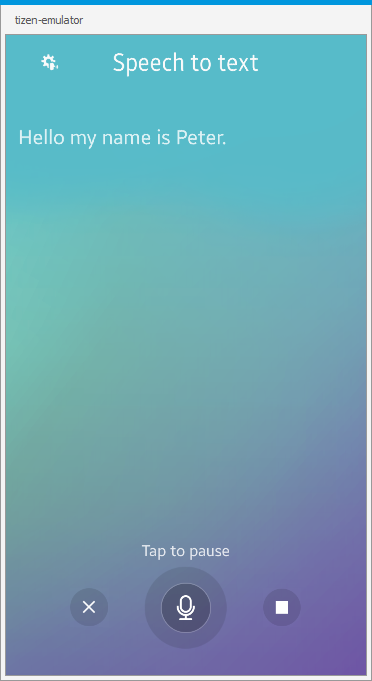
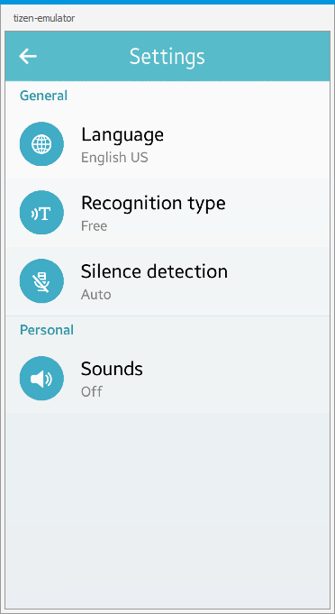

# SpeechToText
SpeechToText is a sample application which demonstrates how to record and recognize
sound data using [Tizen STT API](https://samsung.github.io/TizenFX/stable/api/Tizen.Uix.Stt.html).

### Features
* Starting/pausing/stopping recognition
* Clearing results
* Settings - Language
* Settings - Recognition type
* Settings - Silence detection
* Settings - Sounds (start, end)

### Prerequisites

* [Visual Studio](https://www.visualstudio.com/) - Buildtool, IDE
* [Visual Studio Tools for Tizen](https://docs.tizen.org/application/vstools/install) - Visual Studio plugin for Tizen .NET application development

### Author
* Piotr Górny
