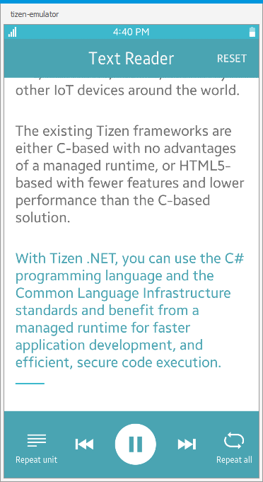

# TextReader
Text Reader is a sample application which demonstrates how to synthesize voice
from text using [Tizen TTS API](https://samsung.github.io/TizenFX/stable/api/Tizen.Uix.Tts.html).

### Features
* Input text divided into paragraphs
* Start/pause
* Previous/next paragraph
* Repeat unit
* Repeat all
* Reset

### Prerequisites

* [Visual Studio](https://www.visualstudio.com/) - Buildtool, IDE
* [Visual Studio Tools for Tizen](https://docs.tizen.org/application/vstools/install) - Visual Studio plugin for Tizen .NET application development

### Author
* Piotr Górny
