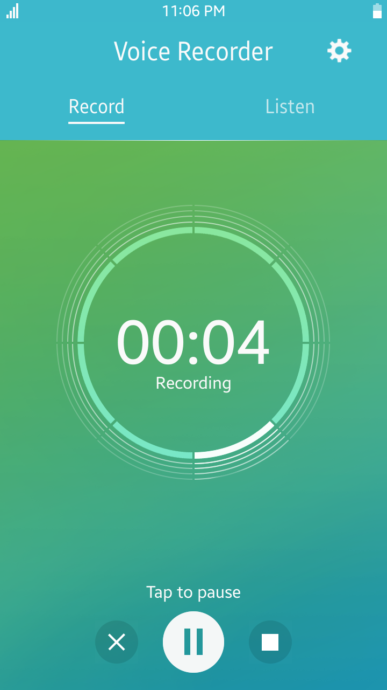
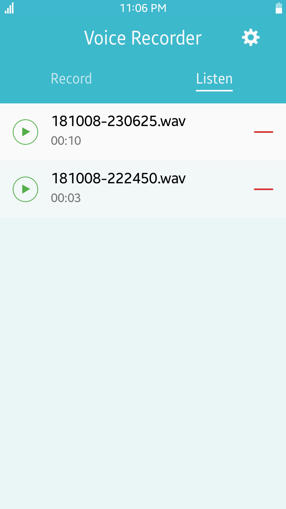
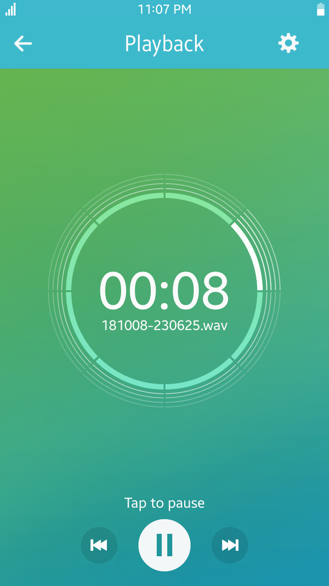

# VoiceRecorder
VoiceRecorder is a sample application which demonstrates how to control audio
recording using [Tizen Multimedia API](https://samsung.github.io/TizenFX/stable/api/Tizen.Multimedia.html).

### Features
* Audio file recording
* Recordings playback
* Settings - record in stereo
* Settings - recording quality
* Settings - file format

### Prerequisites

* [Visual Studio](https://www.visualstudio.com/) - Buildtool, IDE
* [Visual Studio Tools for Tizen](https://docs.tizen.org/application/vstools/install) - Visual Studio plugin for Tizen .NET application development

### Author
* Mateusz Szperna
