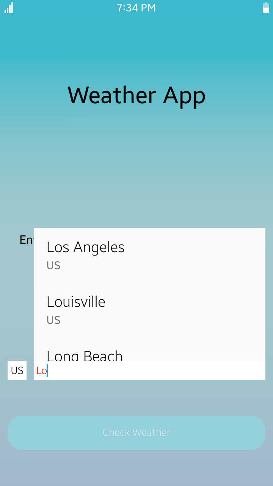
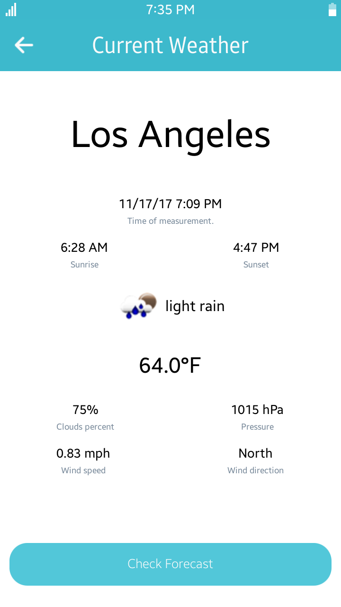
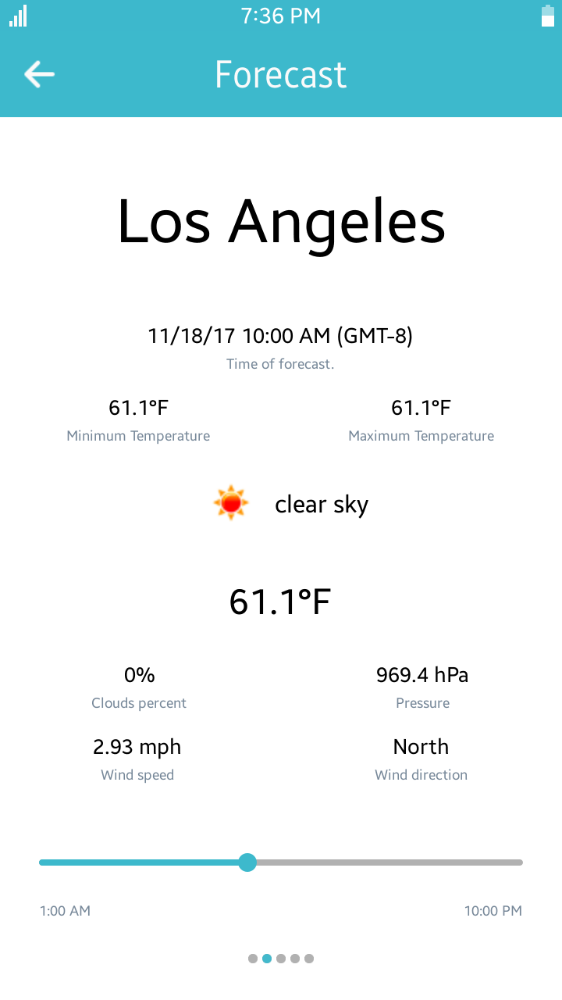
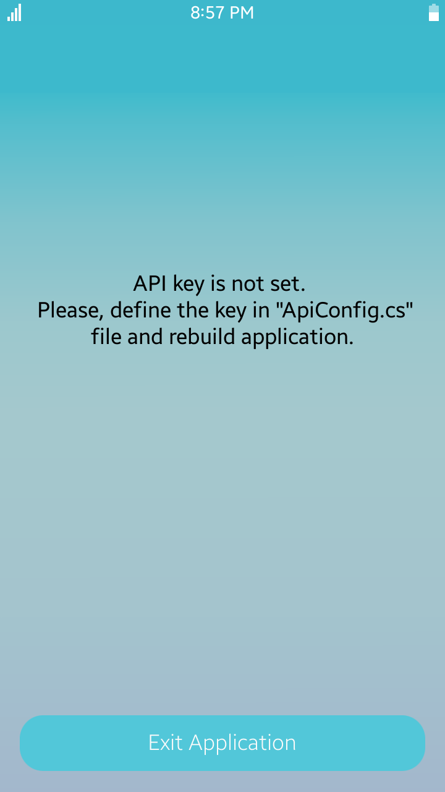
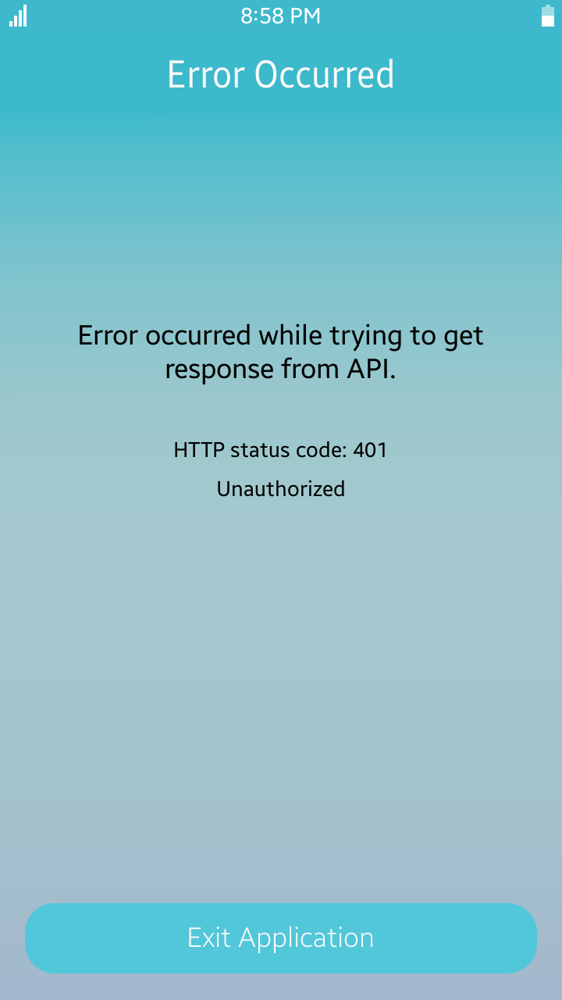

# Weather
Weather is a sample application that demonstrates how to obtain data provided by the RESTful API using the [OpenWeatherMap](<https://openweathermap.org/>) API.

### Features
* Checking current weather in the biggest US cities (only US country code is acceptable to display list of cities).
* Checking forecast for next 5 days.

### Prerequisites
* [Visual Studio](https://www.visualstudio.com/) - Buildtool, IDE
* [Visual Studio Tools for Tizen](https://docs.tizen.org/application/vstools/install) - Visual Studio plugin for Tizen .NET application development

### Author
* Michał Kołodziejski
