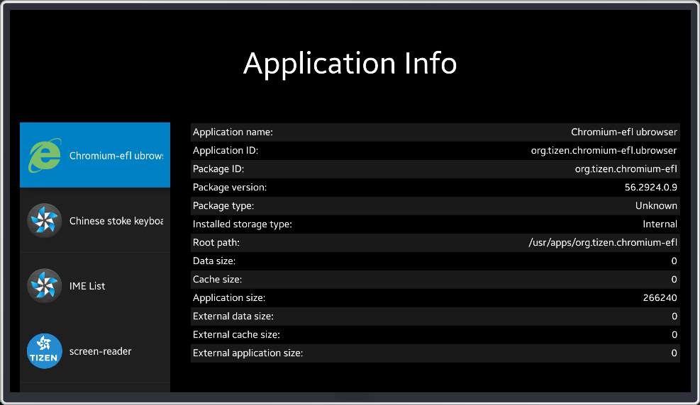

# AppInfo
AppInfo is a sample application that demonstrates how to obtain information about installed applications using [Tizen Applications API](https://developer.tizen.org/dev-guide/csapi/api/Tizen.Applications.html).

### Features
* Displaying detailed information about selected application

### Prerequisites
* [Visual Studio](https://www.visualstudio.com/) - Buildtool, IDE
* [Visual Studio Tools for Tizen](https://developer.tizen.org/development/tizen-.net-preview/visual-studio-tools-tizen) - Visual Studio plugin for Tizen .NET application development

### Author
* Dariusz Paziewski