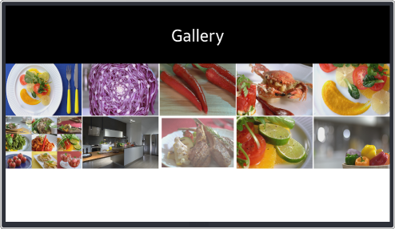
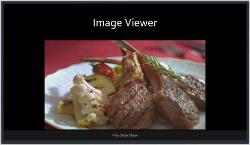

# Gallery
Gallery is the simple image viewer application that allows you to select and enjoy images.
Gallery sample is mainly designed for Tizen TV profile and it is written in [XAML](https://developer.xamarin.com/guides/xamarin-forms/xaml/). It has a custom layout and shows how events are processed in the application. It also includes [DependencyService](https://developer.xamarin.com/guides/xamarin-forms/application-fundamentals/dependency-service/) and [Binding](https://developer.xamarin.com/guides/xamarin-forms/xaml/xaml-basics/data_binding_basics/)

### Verified Version
* Xamarin.Forms : 2.4.0.18342
* Xamarin.Platform.Tizen : 2.4.0.18342
* Tizen.NET : 4.0.0
* Tizen.NET.SDK : 1.0.0

### Supported Profile
* TV

### Author
* Chungryeol Lim
