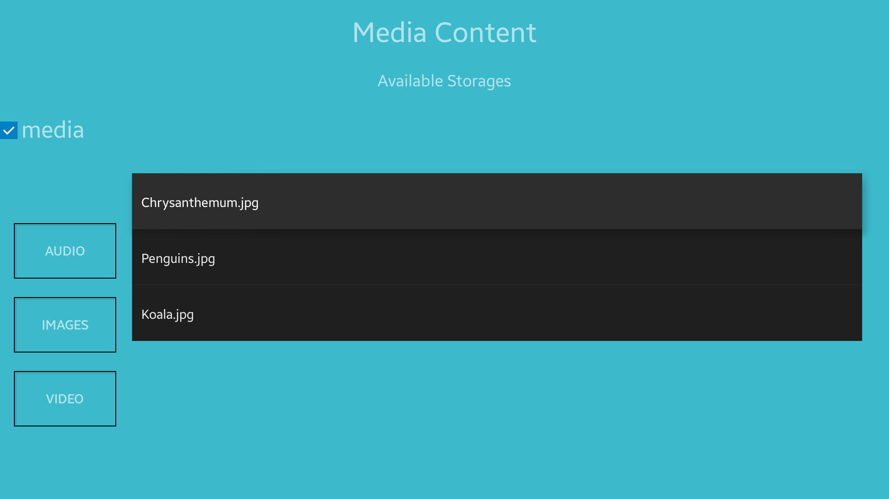
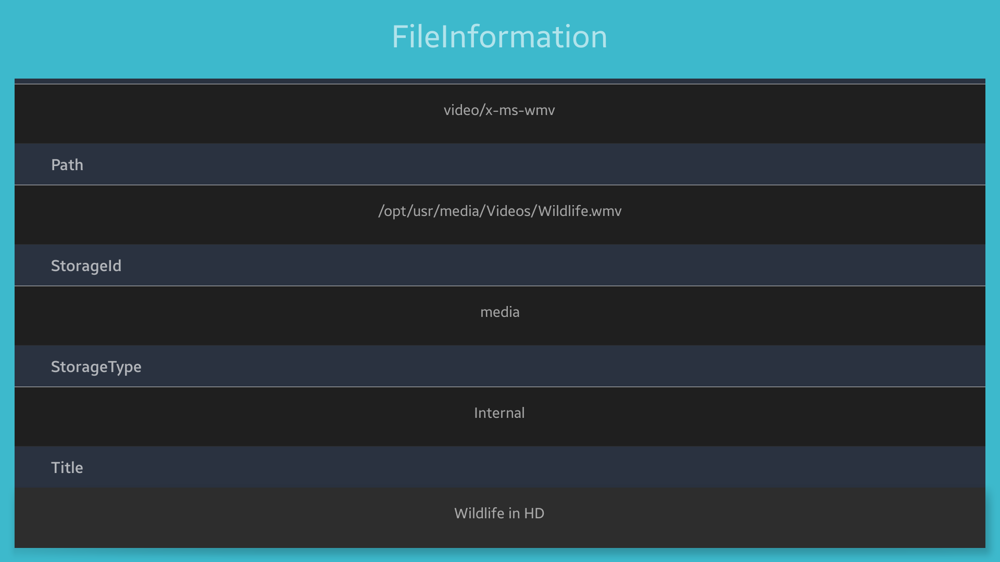

# MediaContent
MediaContent is a sample application that demonstrates how to obtain and filter media content information from internal and external storages.

### Features
* Scanning internal and external storages
* Filtering media content information
* Obtaining detailed information

### Prerequisites
* [Visual Studio](https://www.visualstudio.com/) - Buildtool, IDE
* [Visual Studio Tools for Tizen](https://samsung.github.io/Tizen.CircularUI/api/index.html) - Visual Studio plugin for Tizen .NET application development

### Author
* Tomasz Bochenski
