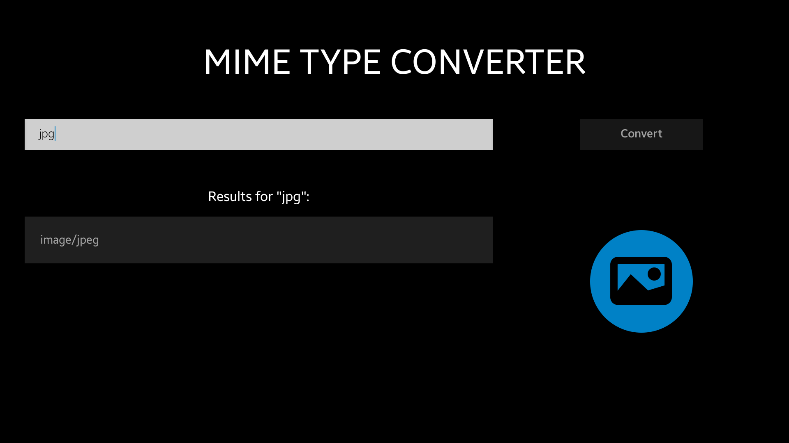

# MimeTypeConverter
MimeTypeConverter is a sample application which demonstrates how to use Tizen.Content.MimeType.MimeUtil.

### Features
* Converting MIME type to the list of corresponding extensions.
* Converting extension to the corresponding MIME type.

### Prerequisites

* [Visual Studio](https://www.visualstudio.com/) - Buildtool, IDE
* [Visual Studio Tools for Tizen](https://developer.tizen.org/development/visual-studio-tools-tizen/installing-visual-studio-tools-tizen) - Visual Studio plugin for Tizen .NET application development

### Author
* Patryk Falba
* Mateusz Szperna
