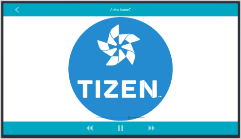

# MusicPlayerUI
MusicPlayerUI is the sample UI application that shows how you can compose the music player application.
UI is written in [XAML](https://developer.xamarin.com/guides/xamarin-forms/xaml/). [Behaviors](https://developer.xamarin.com/guides/xamarin-forms/application-fundamentals/behaviors/) and [Binding](https://developer.xamarin.com/guides/xamarin-forms/xaml/xaml-basics/data_binding_basics/) features are mainly used.

### Verified Version
* Xamarin.Forms : 2.4.0.18342
* Xamarin.Platform.Tizen : 2.4.0.18342
* Tizen.NET : 4.0.0
* Tizen.NET.SDK : 1.0.0

### Supported Profile
* TV

### Author
* Chungryeol Lim
