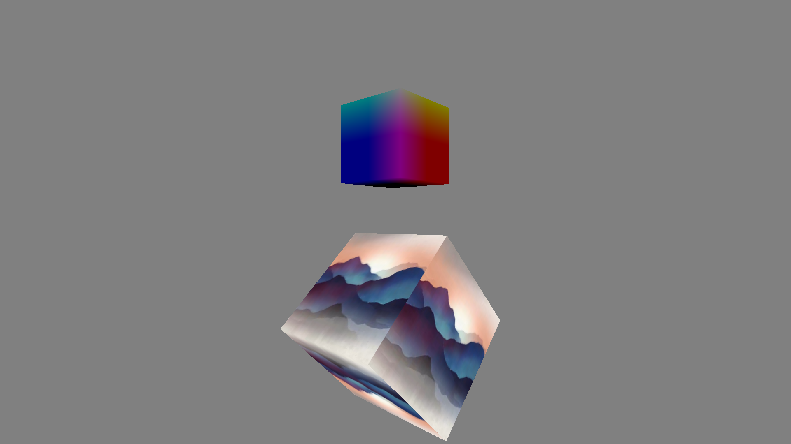

# CubeTexture
This sample application mainly shows how to draw a 3D model (cube), realize the rotation of the model, and add texture to the model.Finally, the application also presents the application of the dual program.

## License
Copyright (c) 2017 Samsung Electronics Co., Ltd.

Licensed under the Apache License, Version 2.0 (the "License");
you may not use this file except in compliance with the License.
You may obtain a copy of the License at

http://www.apache.org/licenses/LICENSE-2.0

Unless required by applicable law or agreed to in writing, software
distributed under the License is distributed on an "AS IS" BASIS,
WITHOUT WARRANTIES OR CONDITIONS OF ANY KIND, either express or implied.
See the License for the specific language governing permissions and
limitations under the License.

### Verified Version
* Tizen.NET : 6.0.0
* Tizen.NET.SDK : 1.0.9
* OpenTK.Tizen : 3.0.2

### Supported Profile
* TV

### Author
* Yan Zhao
