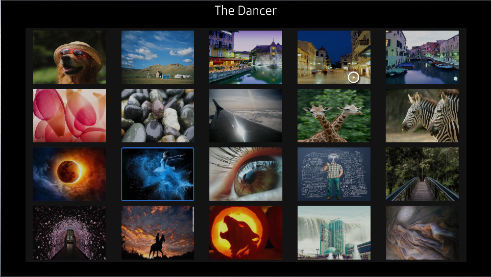

# Movie Library Example

Simple example of [Tizen.NUI.BaseComponents.TableView](https://samsung.github.io/TizenFX/latest/api/Tizen.NUI.BaseComponents.TableView.html) usage. App shows collection of available movies and display title of focused movie.

### Gallery app view

### Verified Version
* Tizen.Net : 6.0.0
* Tizen.Net.SDK : 1.0.9

### Supported Profile
* TV

### Prerequisites
* [Visual Studio](https://www.visualstudio.com/) - Buildtool, IDE
* [Visual Studio Tools for Tizen](https://docs.tizen.org/application/vstools/install) - Visual Studio plugin for Tizen .NET application development