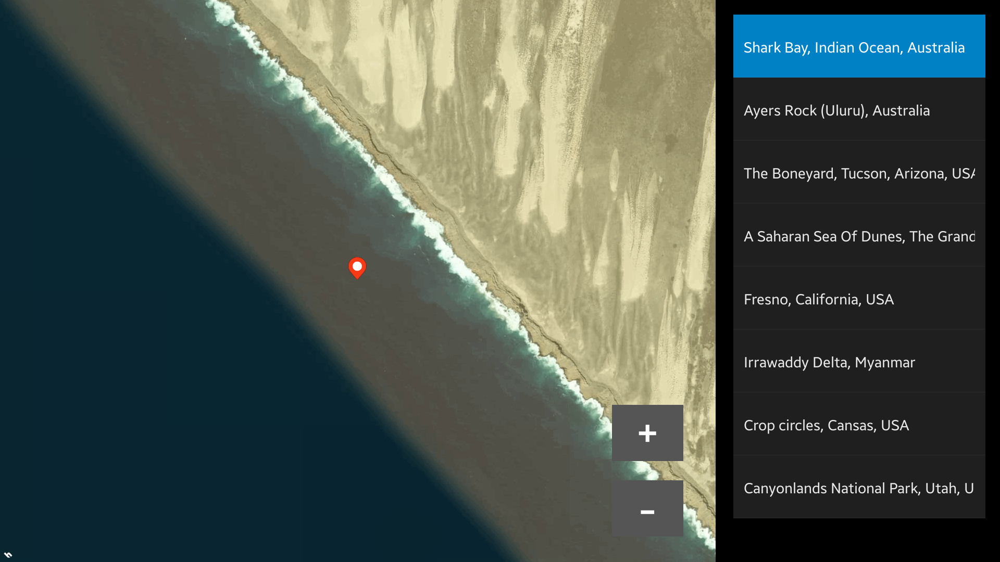

# MapView
MapView is a sample application which demonstrates how to display and control Map component.

### Features
* Defined list of pins to navigate with
* Custom zoom in and zoom out
* Show user location

### Prerequisites

* [Visual Studio](https://www.visualstudio.com/) - Buildtool, IDE
* [Visual Studio Tools for Tizen](https://docs.tizen.org/application/vstools/install) - Visual Studio plugin for Tizen .NET application development

### Author
* Patryk Falba
