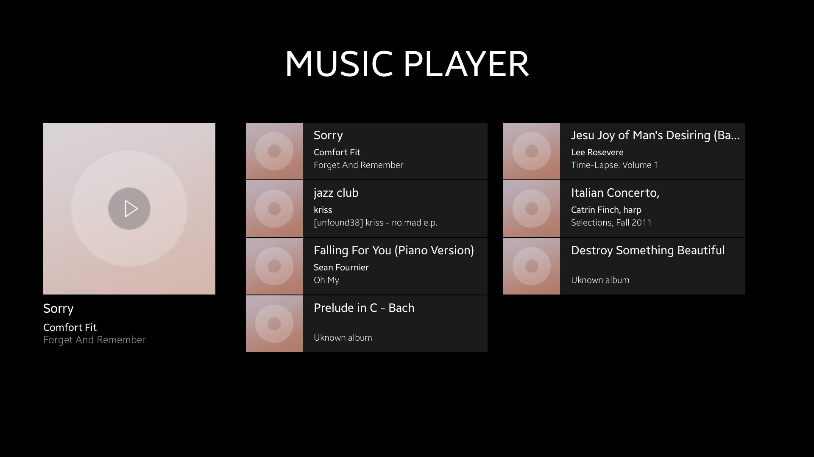
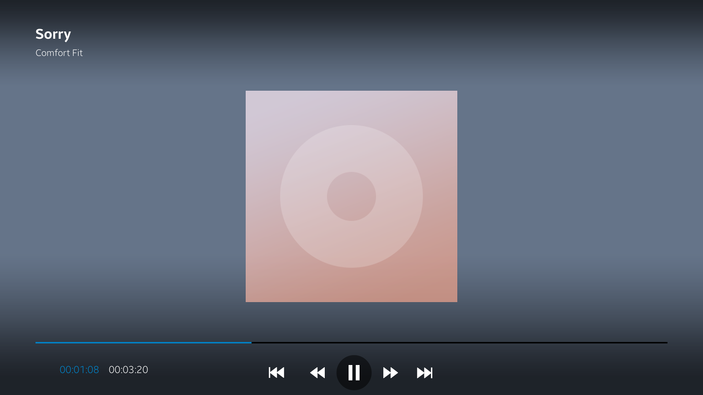

# Music Player
Music Player is a sample application that demonstrates how to use [Tizen Media Content API](https://samsung.github.io/TizenFX/stable/api/Tizen.Content.MediaContent.html) and [Tizen Multimedia API](https://samsung.github.io/TizenFX/stable/api/Tizen.Multimedia.html) to play and manage music stored on device.

### Features
* Taking music media content stored on device and displaying information about it in form of horizontally scrollable list.
* Playing the music and managing the playback of the player.

### Prerequisites
* [Visual Studio](https://www.visualstudio.com/) - Buildtool, IDE
* [Visual Studio Tools for Tizen](https://docs.tizen.org/application/vstools/install) - Visual Studio plugin for Tizen .NET application development

### Author
* Michal Lesniak

