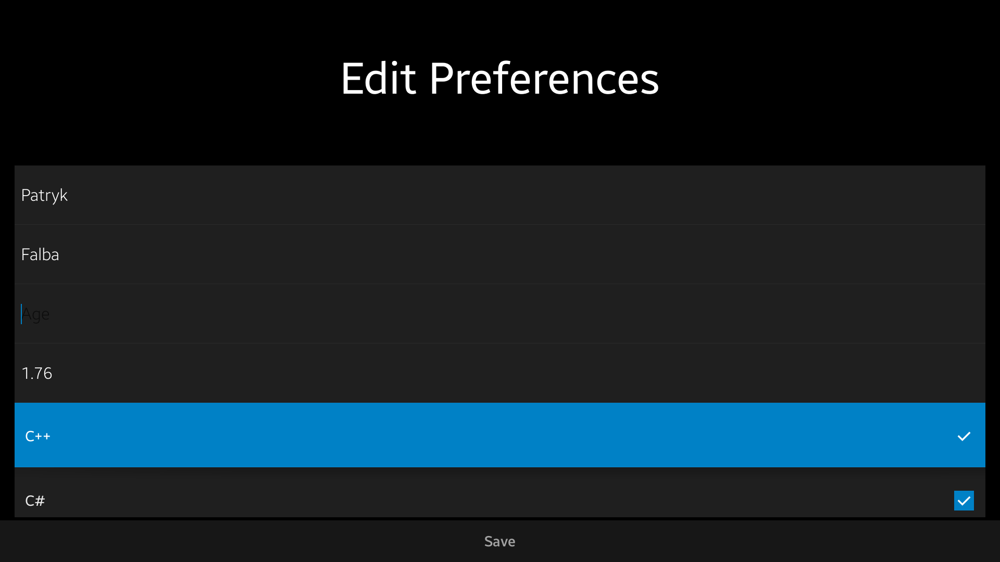

# Preference
Preference is a sample application which demonstrates how to use [Tizen.Applications](https://samsung.github.io/TizenFX/stable/api/Tizen.Applications.Preference.html).

### Features
* Store user provided data.

### Prerequisites

* [Visual Studio](https://www.visualstudio.com/) - Buildtool, IDE
* [Visual Studio Tools for Tizen](https://docs.tizen.org/application/vstools/install) - Visual Studio plugin for Tizen .NET application development

### Author
* Patryk Falba
