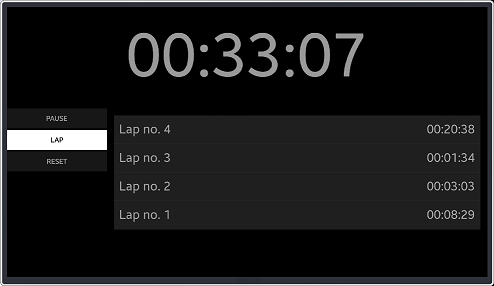

# Stopwatch
Text Reader is a sample application which demonstrates how to create application
measuring the amount of time something takes using Xamarin.Forms.

### Features
* Start/pause
* Laps
* Reset

### Prerequisites

* [Visual Studio](https://www.visualstudio.com/) - Buildtool, IDE
* [Visual Studio Tools for Tizen](https://docs.tizen.org/application/vstools/install) - Visual Studio plugin for Tizen .NET application development

### Author
* Piotr Górny
