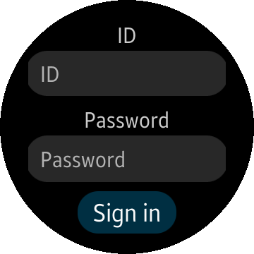

# Tizen .NET Sample Account
The Account application demonstrates how to implement an account provider which can add and configure an account.

### Features
* Managing accounts using [Tizen.Account.AccountManager](https://developer.tizen.org/dev-guide/csapi/api/Tizen.Account.AccountManager.html)

### Prerequisites

* [Visual Studio](https://www.visualstudio.com/) - Buildtool, IDE
* [Visual Studio Tools for Tizen](https://developer.tizen.org/development/visual-studio-tools-tizen/installing-visual-studio-tools-tizen) - Visual Studio plugin for Tizen .NET application development

### Author
* This application is a port of a [mobile app](/../../tree/master/Mobile/Accounts). The port was created by Tomasz Zalewski.
