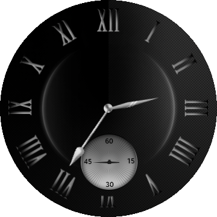

# AmbientWatch #

The AmbientWatch application demonstrates how to make a watch application that supports ambient mode in Tizen wearable device.
To extend battery life, a watch application can display a limited UI in ambient mode by detecting ambient mode changes.

* In ambient mode

First of all, "ambient-support" attribute should be set to true as follows:

 <watch-application appid="org.tizen.example.AmbientWatch" exec="AmbientWatch.dll" type="dotnet" ambient-support="true">
 </watch-application>

You can get details about ambient-support attribute from https://developer.tizen.org/development/tizen-studio/native-tools/configuring-your-app/manifest-text-editor

To use the ambient mode, you must enable it in Settings application.
  Launch "Settings" App -> Select "Watch faces and styles" -> Choose "Watch always on" -> Enable it

In addition, the ambient mode activates only when you are wearing a watch on your wrist.

