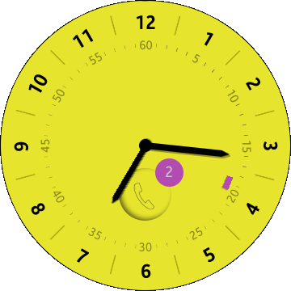

# AnalogWatch
AnalogWatch is a sample application showing how to create watchface for the wearable device using ElmSharp and how to use Badges API.

### Features
* Once installed, it can be set as a watch face.

### Prerequisites

* [Visual Studio](https://www.visualstudio.com/) - Buildtool, IDE
* [Visual Studio Tools for Tizen](https://developer.tizen.org/development/visual-studio-tools-tizen/installing-visual-studio-tools-tizen) - Visual Studio plugin for Tizen .NET application development

### Author
* Michał Skorupiński
