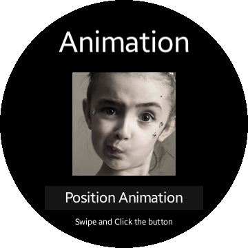

# AnimationSample
This sample demonstrates how to use Animation in Tizen.NUI. You can use the Animation to change Position, Size, Scale, Orientation, Opacity, and Pixel Area. Each of Animation can be applied separately or simultaneously.

## License
Copyright (c) 2018 Samsung Electronics Co., Ltd.

Licensed under the Apache License, Version 2.0 (the "License");
you may not use this file except in compliance with the License.
You may obtain a copy of the License at

http://www.apache.org/licenses/LICENSE-2.0

Unless required by applicable law or agreed to in writing, software
distributed under the License is distributed on an "AS IS" BASIS,
WITHOUT WARRANTIES OR CONDITIONS OF ANY KIND, either express or implied.
See the License for the specific language governing permissions and
limitations under the License.

### Verified Version
* Tizen.NET : 5.0.0
* Tizen.NET.SDK : 1.0.0

### Supported Profile
* Wearable

### Author
* Feng Jin, modified by Seungho Baek for the wearable sample.
