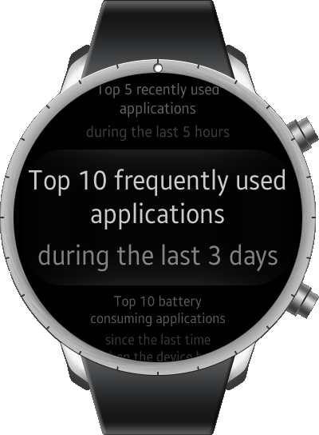
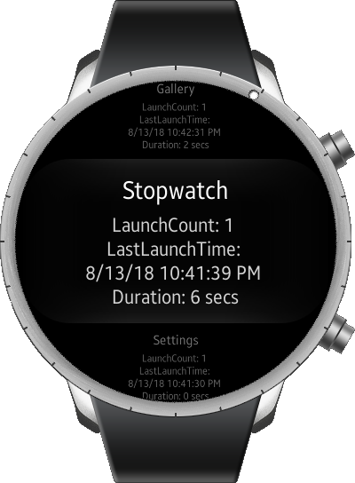

# AppHistory

The AppHistory sample application demonstrates how you can retrieve the user's application usage patterns.
This sample uses XAML files for GUI.

<table>
<tr>
<td>

</td>
<td>

</td>
</tr>
</table>

### Verified Version
* Xamarin.Forms : 3.1.0.637273
* Tizen.NET : 4.0.0
* Tizen.NET.SDK : 1.0.1
* Tizen.Wearable.CircularUI : 1.0.0-pre2-00065

### Supported Profile
* Wearable

### Author
This app is a Wearable port of the [Mobile app](../../Mobile/AppHistory) by Somin Kimi. Ported by Jakub Siewierski.
