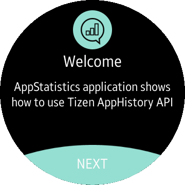
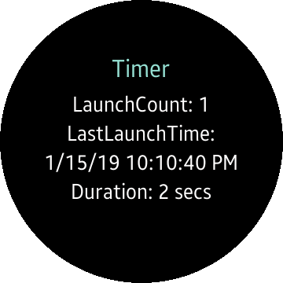

# App Statistics
App Statistics is a sample application that shows how to get information about applications usage using [Tizen AppHistory API](https://developer.tizen.org/dev-guide/csapi/api/Tizen.Context.AppHistory.html).

### Features
* Displays information about amount of the battery used by each application present on the device.
* Provides information about last launch of each application as well as its time on the screen.

### Prerequisites
* [Visual Studio](https://www.visualstudio.com/) - Buildtool, IDE
* [Visual Studio Tools for Tizen](https://developer.tizen.org/development/visual-studio-tools-tizen/installing-visual-studio-tools-tizen) - Visual Studio plugin for Tizen .NET application development

### Author
* Michal Lesniak