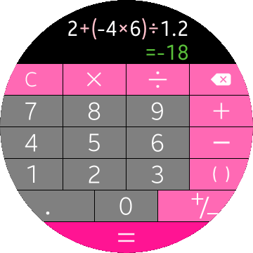

# Tizen .NET Calculator Sample

A sample Calculator application. This sample is using some Xamarin.Forms features such as XAML files for GUI and Custom Renderers for the image buttons.

### Verified Version
* Xamarin.Forms : 3.1.0.697729
* Tizen.Wearable.CircularUI : 1.0.0-pre2-00079
* Tizen.NET : 4.0.0
* Tizen.NET.Sdk : 1.0.1

### Supported Profile
* Wearable

### Author

This app is a port of mobile version of [Calculator app](/../../tree/master/Mobile/Calculator). The port was created by Jakub Troć.
