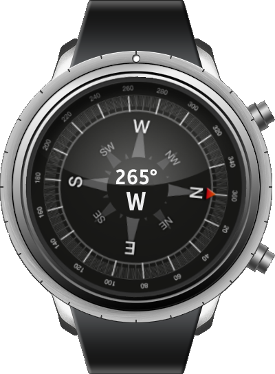

# Compass
Compass is a sample application that demonstrates how to retrieve information about physical orientation of the device using the [Tizen Orientation Sensor API](https://samsung.github.io/TizenFX/stable/api/Tizen.Sensor.OrientationSensor.html).

### Features
* Showing direction relative to the geographic cardinal directions

### Prerequisites
* [Visual Studio](https://www.visualstudio.com/) - Buildtool, IDE
* [Visual Studio Tools for Tizen](https://docs.tizen.org/application/vstools/install) - Visual Studio plugin for Tizen .NET application development

### Author
* Mateusz Szperna
