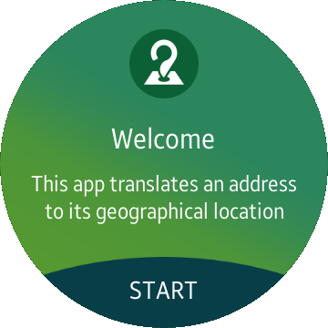

# Geocoding
Geocoding is a sample application that shows how to translate an address to its geographical location using the [Tizen Maps API](https://developer.tizen.org/dev-guide/csapi/api/Tizen.Maps.html).

### Features
* Translating an address to its geographical location defined in terms of latitude and longitude.

### Prerequisites

* [Visual Studio](https://www.visualstudio.com/) - Buildtool, IDE
* [Visual Studio Tools for Tizen](https://developer.tizen.org/development/visual-studio-tools-tizen/installing-visual-studio-tools-tizen) - Visual Studio plugin for Tizen .NET application development

### Author
* Dariusz Paziewski
