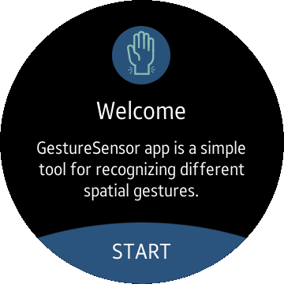
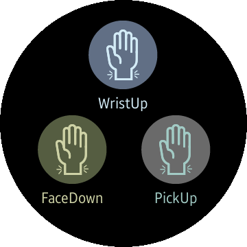
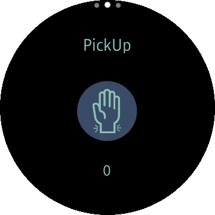

# GestureSensor
GestureSensor is a sample application that shows how to use GestureAPI and detect gestures, such us face down, pick up and wrist up.
* [FaceDownGestureDetector API](https://developer.tizen.org/dev-guide/csapi/api/Tizen.Sensor.FaceDownGestureDetector.html)
* [PickUpGestureDetector API](https://developer.tizen.org/dev-guide/csapi/api/Tizen.Sensor.PickUpGestureDetector.html)
* [WristUpGestureDetector API](https://developer.tizen.org/dev-guide/csapi/api/Tizen.Sensor.WristUpGestureDetector.html)

### Features
* Detecting gestures.

### Prerequisites
* [Visual Studio](https://www.visualstudio.com/) - Buildtool, IDE
* [Visual Studio Tools for Tizen](https://developer.tizen.org/development/visual-studio-tools-tizen/installing-visual-studio-tools-tizen) - Visual Studio plugin for Tizen .NET application development

### Author
* Michal Kolodziejski