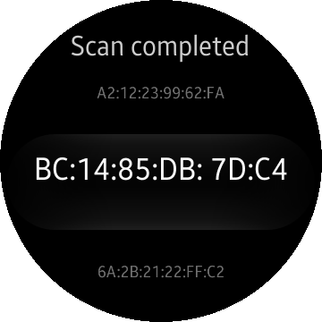

# Lescanner
Lescanner is a sample application which demonstrates how to use [Tizen.Network.Bluetooth](https://developer.tizen.org/dev-guide/csapi/api/Tizen.Network.Bluetooth.html) to connect with Bluetooth Low Energy devices.

### Features
* Listing available BLE devices and their services.

### Prerequisites

* [Visual Studio](https://www.visualstudio.com/) - Buildtool, IDE
* [Visual Studio Tools for Tizen](https://developer.tizen.org/development/visual-studio-tools-tizen/installing-visual-studio-tools-tizen) - Visual Studio plugin for Tizen .NET application development

### Author
* The application is a port of a [mobile app](/../../tree/master/Mobile/Lescanner). The port was created by Tomasz Zalewski.
