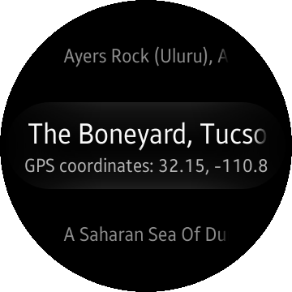

# MapsView
MapsView is a sample application which demonstrates how to display and control Map component.

### Features
* Defined list of pins to navigate with
* Custom zoom in and zoom out (bezel rotation)

### Prerequisites

* [Visual Studio](https://www.visualstudio.com/) - Buildtool, IDE
* [Visual Studio Tools for Tizen](https://developer.tizen.org/development/visual-studio-tools-tizen/installing-visual-studio-tools-tizen) - Visual Studio plugin for Tizen .NET application development
* [HERE](https://www.here.com/en) - HERE mapping platform API key is required 

### Author
* @Piotr12 (port of Mobile MapsView app)
