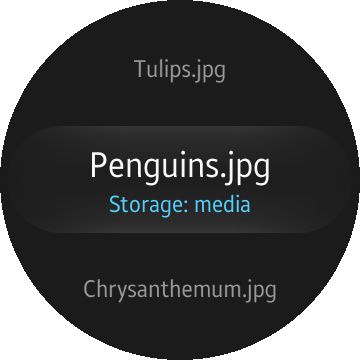
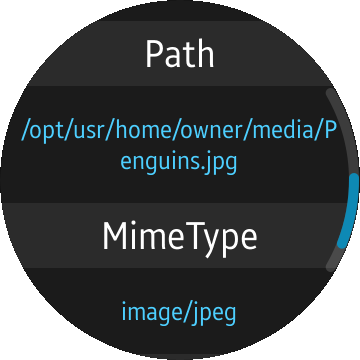

# MediaContent
MediaContent is a sample application that demonstrates how to obtain and filter media content information from available storages.

### Features
* Scanning internal and external storages
* Filtering media content information
* Obtaining detailed information

### Prerequisites
* [Visual Studio](https://www.visualstudio.com/) - Buildtool, IDE
* [Visual Studio Tools for Tizen](https://developer.tizen.org/development/tizen-.net-preview/visual-studio-tools-tizen) - Visual Studio plugin for Tizen .NET application development

### Resources
* Icons used in this project come from [Font Awesome](https://fontawesome.com/) and were converted to .png using [fa2png](http://fa2png.io/).

### Author
* This application is based on a [TV app](/../../tree/master/TV/MediaContent) originally made by Tomasz Bochenski. The port was created by Tomasz Zalewski.
