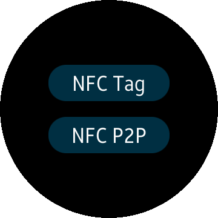

# NFC
The NFC applicaiton allows you to send and receive a NDEF message from remote NFC device, and read NDEF message from NFC Tag.

### Features
* Connect via NFC using [Tizen.Network.Nfc](https://developer.tizen.org/dev-guide/csapi/api/Tizen.Network.Nfc.html)

### Prerequisites

* [Visual Studio](https://www.visualstudio.com/) - Buildtool, IDE
* [Visual Studio Tools for Tizen](https://developer.tizen.org/development/visual-studio-tools-tizen/installing-visual-studio-tools-tizen) - Visual Studio plugin for Tizen .NET application development

### Author
* This application is a port of a [mobile app](/../../tree/master/Mobile/NFCSampleApp) originally made by Jihoon Jung. The port was created by Tomasz Zalewski.
