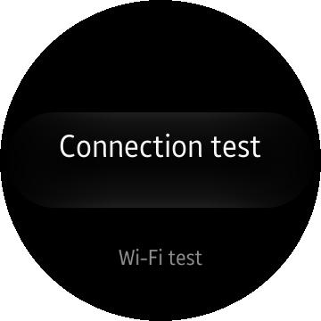
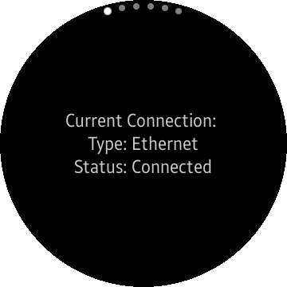
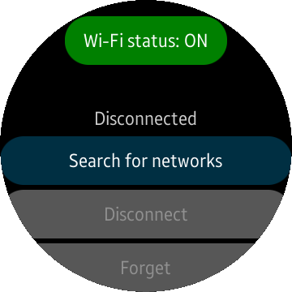

# NetworkApp
The NetworkApp allows you to check info about your connection and manage your Wi-Fi settings.

### Features
* Getting connection info using [Tizen.Network.Connection](https://developer.tizen.org/dev-guide/csapi/api/Tizen.Network.Connection.html)
* Managing Wi-Fi settings and connecting to the network using [Tizen.Network.WiFi](https://developer.tizen.org/dev-guide/csapi/api/Tizen.Network.WiFi.html)

### Prerequisites

* [Visual Studio](https://www.visualstudio.com/) - Buildtool, IDE
* [Visual Studio Tools for Tizen](https://developer.tizen.org/development/visual-studio-tools-tizen/installing-visual-studio-tools-tizen) - Visual Studio plugin for Tizen .NET application development

### Author
* Tomasz Zalewski
* Based on mobile version of [NetworkApp](/../../tree/master/Mobile/NetworkApp).
