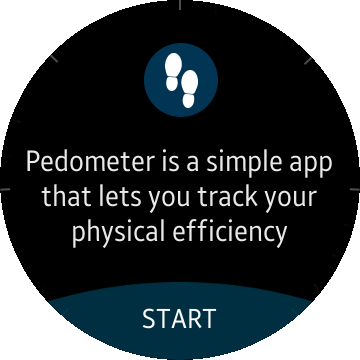
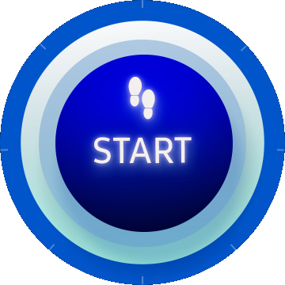

# Pedometer
Pedometer is a sample application which demonstrates how to use [Pedometer](https://samsung.github.io/TizenFX/stable/api/Tizen.Sensor.Pedometer.html) (Tizen.Sensor API).

### Features
* Counts steps

### Prerequisites

* [Visual Studio](https://www.visualstudio.com/) - Buildtool, IDE
* [Visual Studio Tools for Tizen](https://docs.tizen.org/application/vstools/install) - Visual Studio plugin for Tizen .NET application development

### Author
* Rafał Chabasiński
