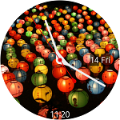
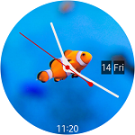

# PhotoWatch

PhotoWatch sample application is a Watch Face application which demonstrates how to make a watch face application for Tizen wearable devices.

### Verified Version
* Xamarin.Forms : 3.1.0.697729
* Tizen.Wearable.CircularUI 1.0.0-pre2-00065
* Tizen.NET : 4.0.0
* Tizen.NET.SDK : 1.0.1

### Supported Profile
* Wearable

### Author
* Seungkeun Lee (https://github.com/myroot)

