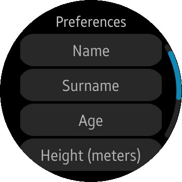
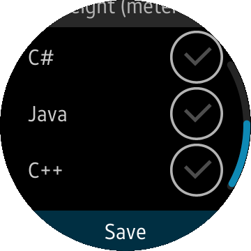

# Preference
Preference is a sample application which demonstrates how to use [Tizen.Applications](https://developer.tizen.org/dev-guide/csapi/api/Tizen.Applications.Preference.html).

### Features
* Store user provided data.

### Prerequisites

* [Visual Studio](https://www.visualstudio.com/) - Buildtool, IDE
* [Visual Studio Tools for Tizen](https://developer.tizen.org/development/visual-studio-tools-tizen/installing-visual-studio-tools-tizen) - Visual Studio plugin for Tizen .NET application development

### Author
* This application is a port of a [mobile app](/../../tree/master/Mobile/Preference) originally made by Patryk Falba. The port was created by Tomasz Zalewski.
