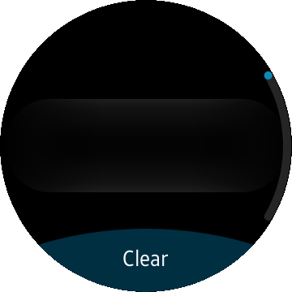
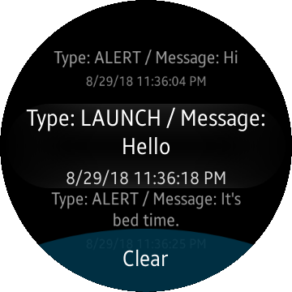

# Push Receiver

The Push Receiver sample application demonstrates how you can receive push notification from application server through push server.

The following figure illustrates the main screen of the Push Receiver sample application:



The application opens with the main screen, which displays just a button for clearing list of push message:
* To receive push notification, you need an application server which sends push request to Push server or you can use a curl command to send push request to Push server.
* Example of the curl command is showed below:

```
$ curl -k --header "appID: 51642f356c585db3" --header "appSecret: 238F539EC07F2B9CAF07B9D238E15362" https://apnortheast.push.samsungosp.com:8090/spp/pns/api/push --header "Content-Type: application/json" -d "{\"regID\": \"05013fe0b87302eafcbf26e454da3fdc1e4f2bd8cad93f1ba05a97e9ced4f127afbea2510832b51b3ac1356eb78ab870d7c9\", \"requestID\": \"0000001\", \"message\":\"badgeOption=INCREASE&badgeNumber=1&action=ALERT&alertMessage=Hi\", \"appData\": \"{id:qwer12&passwd:1234}\"}"
```
* In the above curl command example, the parameters are:
  * __appID__ : Push app id. You can get this value from Tizen push server team. See [the request the permission for Tizen push service page](https://developer.tizen.org/webform/request-permission-tizen-push-service). "51642f356c585db3" is an example and invalid value.
  * __appSecret__ : Push app secret. You can also get this value from Tizen push server team. Keep this value safe.
  * __URL__ : Push server URL. For more information, see [Table: Push RQM servers URLs](https://developer.tizen.org/development/guides/native-application/messaging/push-server#send_server) in Push Server guide.
  * __regID__ : Registration ID. This is a unique key used to identify the application installed on that particular device and route the push message. The application receives a registration ID through push service after sending registration request and the request is approved.
  * __message__ : The message delivered to application. For more information about message format, see [Table: Message field key-value pairs](https://developer.tizen.org/development/guides/native-application/messaging/push-server) in Push Server guide.


When the application receives push notification, it shows message like below:



### Prerequisites

* You have to replace "Your Push App ID" in the PushModel() in PushModel.cs file with your push app id.

      public int PushModel()
      {
          // Use your push app id received from Tizen push team
          string AppId = "Your Push App ID";
          ....


### Author
* This application is a port of a [mobile app](/../../tree/master/Mobile/PushReceiver) originally developed by Younho Park. The port was created by Jakub Troć.
