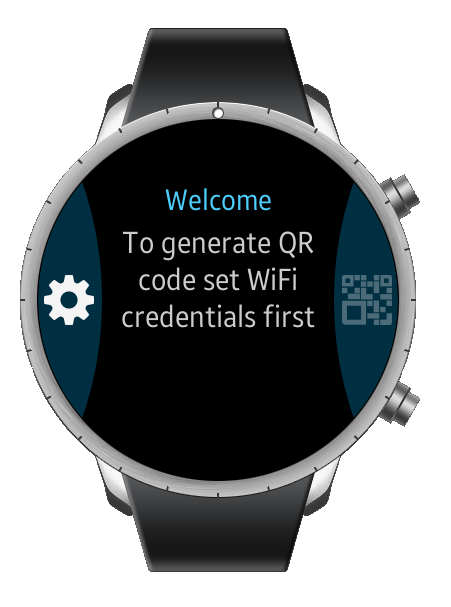
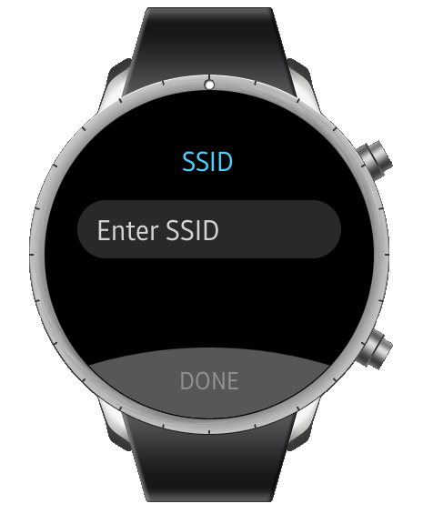
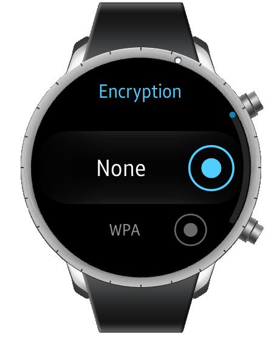
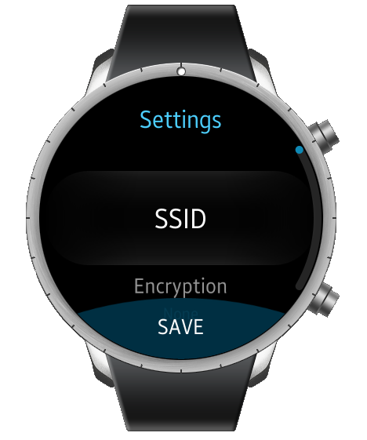
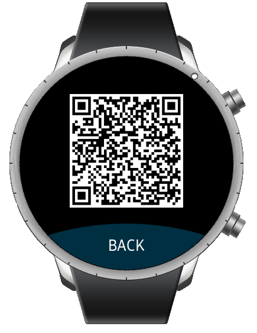

# QRCodeGenerator
QRCodeGenerator is a sample application which demonstrates how to use Tizen.CircularUI NuGet package and BarcodeGenerator class from TizenFX API.

### Features
* Menu items can be scrolled with bezel.

### Prerequisites

* [Visual Studio](https://www.visualstudio.com/) - Buildtool, IDE
* [Visual Studio Tools for Tizen](https://developer.tizen.org/development/visual-studio-tools-tizen/installing-visual-studio-tools-tizen) - Visual Studio plugin for Tizen .NET application development

### Author
* Jakub Sobczuk
