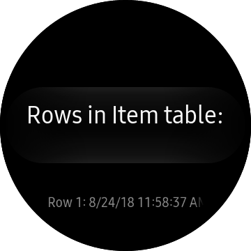
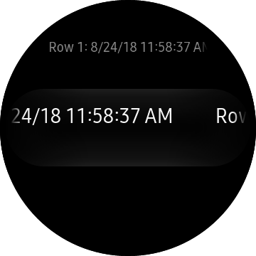
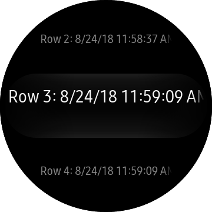

# SQLite.Net.Sample #

SQLite.Net.Sample app demonstrates how to create and connect to an SQLite database and use it in Tizen .Net application.

 - Create and connect to an SQLite database
 - Create and modify(insert) a DB table

   
   

Whenever you relaunch this sample app, two new items are inserted to SQLite databe.

