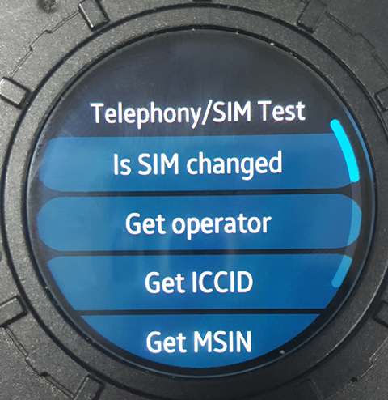

# Telephony
The SampleTelephony application demonstrates how to work with Telephony API in order to get call, modem, network and sim information from telephony framweork.
SampleTelephony is mainly designed for Tizen Wearable profile and it is written in [Developer Site](https://developer.tizen.org/development/guides/.net-application/connectivity-and-wireless/telephony-information).

### Verified Version
* Tizen.NET : 5.0.0.14562
* Tizen.Wearable.CircularUI (including Xamarin.Forms): 1.4.0
* Tizen.NET.Sdk : 1.0.9

### Supported Profile
* Wearable

### Author
* This application is a port of a [mobile app](/../../tree/master/Mobile/SampleTelephony) originally made by Shinhui Kang (sinikang@samsung.com). The port was created by Lokesh kasana (l.kasana@samsung.com).
