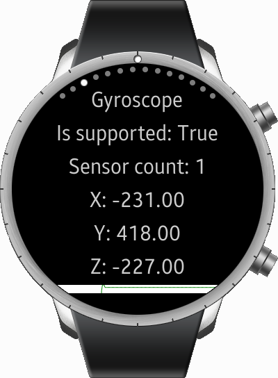
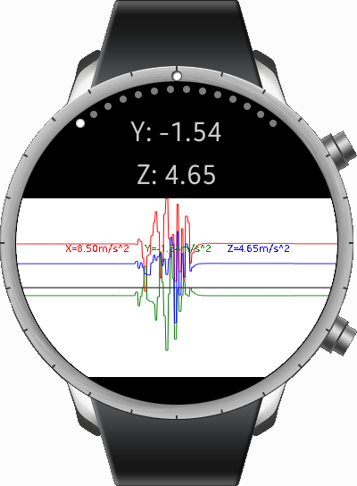
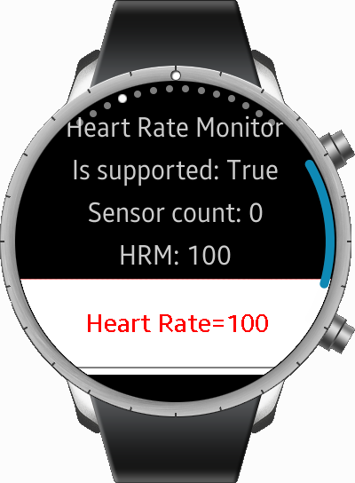
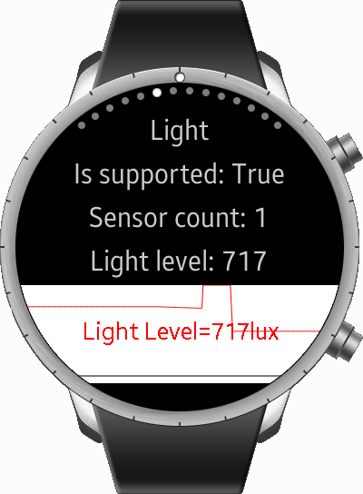

# Sensors

The Sensors sample application demonstrates how you can create an application using the following APIs:

* Tizen.Wearable.CircularUI (including Xamarin.Forms) : 1.4.0
* Tizen FX APIs (Tizen.Sensor, Tizen.Security) : 6.0.0
* SkiaSharp : 1.68.2

