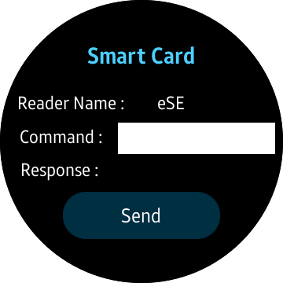
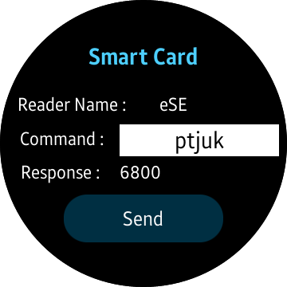

# Smartcard
The Smartcard service allows you to send a command to the SE (Secure Element), and receive a response to the command.
Smartcard sample is designed for Tizen Wearable profile and it is written in [Developer Site](https://docs.tizen.org/application/dotnet/guides/connectivity/smartcard).

### Verified Version
* Tizen.Wearable.CircularUI (including Xamarin.Forms) : 1.4.0
* Tizen.NET : 6.0.0
* Tizen.NET.SDK : 1.0.9

### Supported Profile
* Wearable

### Author
* This application is a port of a [mobile app](/../../tree/master/Mobile/SmartcardSampleApp) originally made by Jihoon Jung. The port was created by Abhishek Sansanwal.
