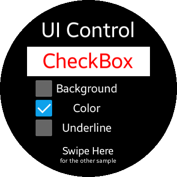
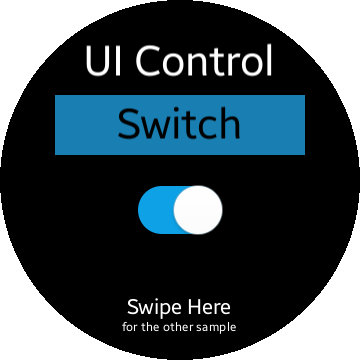

# UIControlSample
This sample demonstrates some basics of `Tizen.NUI.Components`.
Included components are `CheckBox`, `RadioButton`, `Slider`, `Progress Bar` and `Switch`.

# Screenshots
|  |  |  |  |  |
|:---:|:---:|:---:|:---:|:---:|
| CheckBox | Radio Button | Slider | Progress Bar | Switch |

## License
Copyright (c) 2018 Samsung Electronics Co., Ltd.

Licensed under the Apache License, Version 2.0 (the "License");
you may not use this file except in compliance with the License.
You may obtain a copy of the License at

http://www.apache.org/licenses/LICENSE-2.0

Unless required by applicable law or agreed to in writing, software
distributed under the License is distributed on an "AS IS" BASIS,
WITHOUT WARRANTIES OR CONDITIONS OF ANY KIND, either express or implied.
See the License for the specific language governing permissions and
limitations under the License.

### Verified Version
* Tizen.NET : 8.0.0.15524
* Tizen.NET.SDK : 1.1.2

### Supported Profile
* Wearable

### Author
* Primary version was created by Feng Jin, modified by Seungho Baek for the wearable sample.
* Remastered with new features by Michal Maciola.
