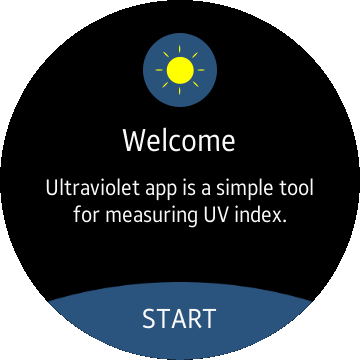
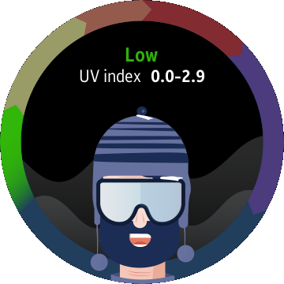
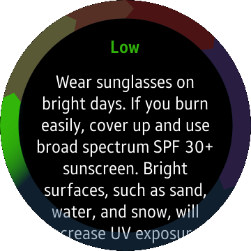

# Ultraviolet
Ultraviolet is a sample application which demonstrates how to use [Tizen.CircularUI](https://samsung.github.io/Tizen.CircularUI/api/index.html) NuGet package and [Ultraviolet sensor](https://samsung.github.io/TizenFX/stable/api/Tizen.Sensor.UltravioletSensor.html) class from TizenFX API.

### Features
* Animated UV level indicator.
* Measures UV level using sensor.

### Prerequisites
* [Visual Studio](https://www.visualstudio.com/) - Buildtool, IDE
* [Visual Studio Tools for Tizen](https://docs.tizen.org/application/vstools/install) - Visual Studio plugin for Tizen .NET application development

### Author
* Piotr Konowrocki
