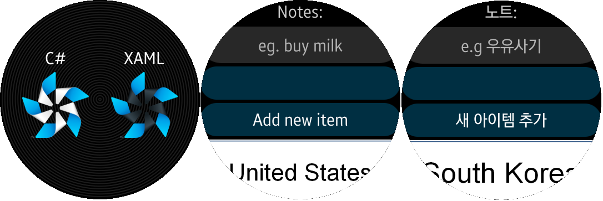

# UsingResxLocalization #

The UsingResxLocalization application demonstrates how to support localized image and text in Tizen .Net Wearable Apps.
This app is based on Xamarin-forms-samples(https://github.com/xamarin/xamarin-forms-samples/tree/master/UsingResxLocalization)
and is modified according to Tizen Wearable UI.

You can get details about localization in Tizen .Net Applications from https://github.com/Samsung/Tizen.CircularUI/blob/master/doc/guide/Localization.md.

How to change the language on Tizen wearable emulator:
 Launch "Settings" App -> Select "Device" menu -> Choose "Language"

This app supports English/Korean/Japanese. The default language is English(United States).

