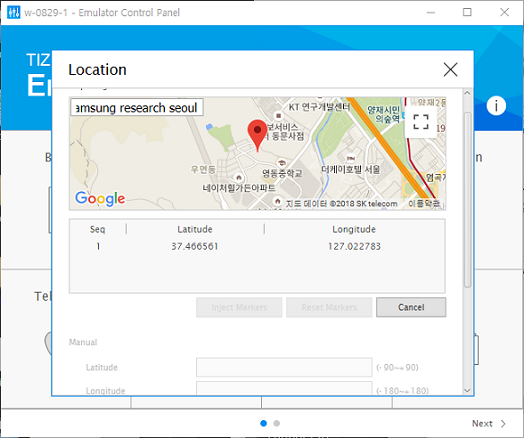
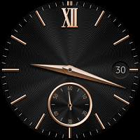
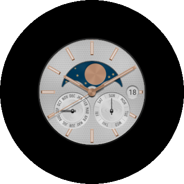
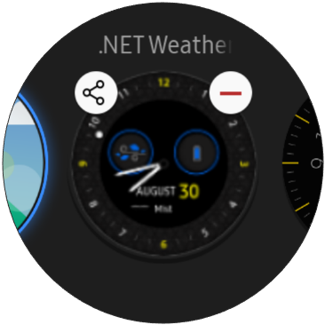
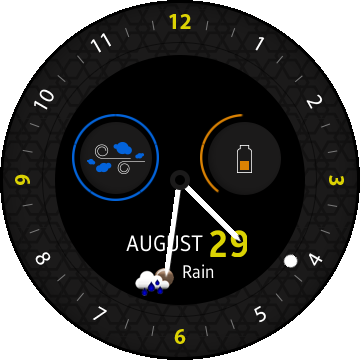
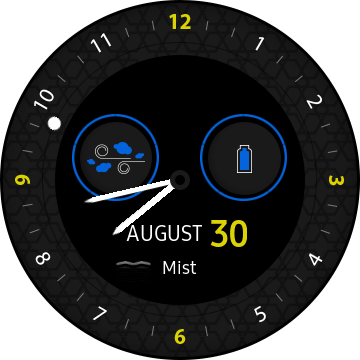
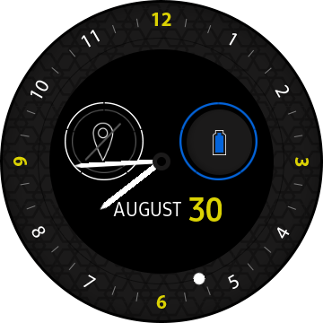
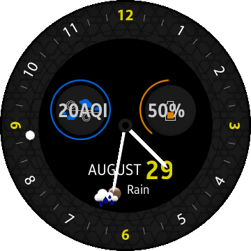
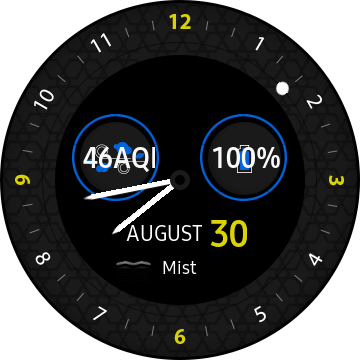

# WeatherWatch #

WeatherWatch sample application is a `Watch Face` application which demonstrates how to make a watch face application for Tizen wearable devices.

In addition, it shows how to obtain data provided by the RESTful API by using the [OpenWeatherMap](https://openweathermap.org) API and the [Real-time air quality index](http://waqi.info) API.

### Prerequisite
1. for build
Before you build this app, you should sign up for a `free API key` at [OpenWeatherMap](http://openweathermap.org/appid).

Please put your api key to *INVALID_API_KEY*  in the following line of **WebSiteInfo.cs** file:
```
public const string WEATHER_API_KEY = INVALID_API_KEY;
```

For Air pollution Quality Index information, you must fill in the `API Token Request Form of Air Quality Open Data Platform` at [Real-time air quality index](http://aqicn.org/data-platform/token/#/).

Please put your token key to *INVALID_API_KEY*  in the following line of **WebSiteInfo.cs** file:

```
public const string AIR_POLLUTION_API_KEY = INVALID_API_KEY;
```

2. for testing
To check full functionalities, **network connection** and **location service** should be available.

You can change location by using `Tizen Studio Emulator Control Panel` for Tizen wearable emulator.

   


### How to change the watch face app

1. Go back to `Home Screen` after you build and install WeatherWatch app.

<p align="left">
 
 
</p>

2. Touch and hold the current watch face.

<p align="left">
 
 
</p>

3. Swipe left/right or rotate the bezel to see available watch faces and select `.Net WeatherWatch`.
<p align="left">
 
 
</p>


If GPS or network connection is not available, weather & AQI information is not shown.
   <p align="left">
   
   </p>

To see the exact values of the AQI & battery percentage, you can check them out by touching the AQI or battery icon images.

(AQI and battery percentage texts are visible or invisible by touching icons.)

<p align="left">
 
 
</p>

