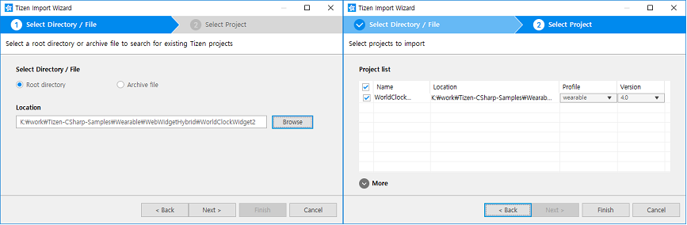
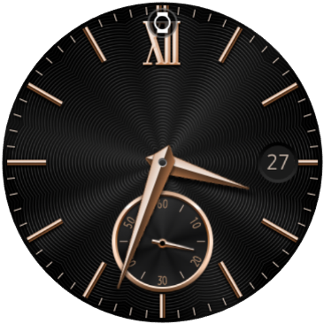
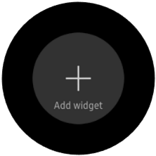
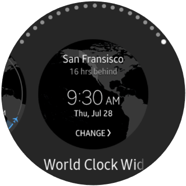
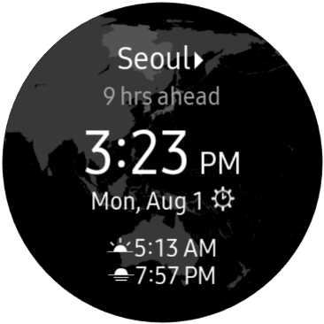

# WebWidgetHybrid #

WebWidgetHybrid sample app demonstrates how to make Tizen hybrid app which is packaged with Tizen Web and .Net applications.

### Prerequisite
 1. [Tizen Studio](https://docs.tizen.org/application/tizen-studio/index) should be installed to build Tizen Web/Hybrid applications.
 2. Check the name of Certificate profile through `Tizen Certificate Manager`
   
 3. Check whether Visual Studio signs the .TPK file using the profile of `Tizen Certificate Manager`.
  Tools > Options > Tizen > Certification > `Sign the .TPK file using the following option.` option is checked.
   

### How to build and execute this hybrid application

1. Build [WorldClockWidget2](https://github.com/Samsung/Tizen-CSharp-Samples/tree/master/Wearable/WebWidgetHybrid/WorldClockWidget2) web application using `Tizen Studio`.
    1. Select `File > Import > Tizen > Tizen Project`
    2. Import WorldClockWidget2 web app as follows:
    
    3. Build this app and create a package(.wgt) file by selecting menu `Project > Build Signed Project` in Tizen Studio.

2. Build [WebWidgetHybrid](https://github.com/Samsung/Tizen-CSharp-Samples/tree/master/Wearable/WebWidgetHybrid/WebWidgetHybrid) .NET application using `Visual Studio`.
    1. Open [WebWidgetHybrid.sln](https://github.com/Samsung/Tizen-CSharp-Samples/blob/master/Wearable/WebWidgetHybrid/WebWidgetHybrid.sln) file.
    2. Build .Net app.

3. Copy the build package files to `C:\tizen-studio\tools\ide\bin`.
    1. the location of `WebWidgetHybrid` .Net app package  : WebWidgetHybrid\WebWidgetHybrid\bin\Debug\tizen40\org.tizen.example.WebWidgetHybrid-1.0.0.tpk
    2. the location of `WorldClockWidget2` web app package : WebWidgetHybrid\WorldClockWidget2\WorldClockWidget2.wgt

4. Build a hybrid package using the following command line.
  C:\tizen-studio\tools\ide\bin\tizen.bat package -t wgt -s tizen-cert -r ./org.tizen.example.WebWidgetHybrid-1.0.0.tpk -- ./WorldClockWidget2.wgt

  ```
   C:\tizen-studio\tools\ide\bin>tizen.bat package -t wgt -s tizen-cert -r ./org.tizen.example.WebWidgetHybrid-1.0.0.tpk -- ./WorldClockWidget2.wgt
   Author certficate: C:/tizen-studio-data/keystore/author/tizen-cert.p12
   Distributor1 certificate : C:\tizen-studio\tools\certificate-generator\certificates\distributor\tizen-distributor-signer.p12
   Package( C:\tizen-studio\tools\ide\bin\WorldClockWidget2.wgt ) is created successfully.
  ```

  ```
   tizen.bat package --help
   Usage: tizen package [args]
    -- <working directory>           Specify where the base directory is for the command
   -s (--sign) <security profile>    Specify the security profile name
   -t (--type) wgt                   Packaging type (wgt for hybrid app)
   -r (--reference) <path>[;...]     Reference prj paths (for HybridApp package)
  ```

5. Install the hybrid app using the following command line:
  sdb install WorldClockWidget2.wgt

  ```
   C:\tizen-studio\tools\ide\bin>sdb install WorldClockWidget2.wgt
   WARNING: Your data are to be sent over an unencrypted connection and could be read by others.
   pushed          WorldClockWidget2.wgt   100%       4361KB           0KB/s
   1 file(s) pushed. 0 file(s) skipped.
   WorldClockWidget2.wgt            8629KB/s (4465694 bytes in 0.505s)
   path is /home/owner/share/tmp/sdk_tools/WorldClockWidget2.wgt
  ```

6. Add a `WebWidgetHybrid` widget from the home screen.
    1. Go to the home screen by pressing the back key.
<p align="left">
 
</p>

    2. Swipe the home screen right or rotate the bezel right until you see `+ Add widget` and select it.
<p align="left">
 
</p>

    3. Swipe right until you see "World Clock Widget" and select it.
<p align="left">
 
</p>

7. Check the added widget by switing the home screen.
   


### Packaging a Hybrid Application (Web + Native App)
You can get details about [Tizen hybrid application(Web + Native app)](https://developer.tizen.org/category/tags/hybrid-application)
 - https://developer.tizen.org/community/tip-tech/communication-within-tizen-hybrid-app
 - https://developer.tizen.org/community/tip-tech/packaging-hybrid-application
 - https://developer.tizen.org/community/tip-tech/how-package-tizen-hybrid-app

