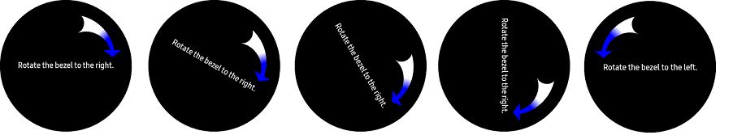

# PlayingWithHWInputs #

PlayingWithHWInputs sample app demonstrates how to handle rotary events from bezel of a wearable device.

In addition, it shows the way how to detect when the back button is pressed.

### When you rotate the bazel right
  

### When you rotate the bazel left
  

### When you press back button
  

This application uses Tizen Wearable CircularUI API.

* [Interface IRotaryEventReceiver][IRotaryEventReceiver]

Also, you can get details about managing rotary event for Tizen native/web applications.

<table>
  <tr>
    <th>App Type</th>
    <th>Guide</th>
  </tr>
  <tr>
    <td>Native</td>
    <td><a href="https://docs.tizen.org/application/native/guides/ui/efl/rotary-events">Managing rotary events</a></td>
  </tr>
  <tr>
    <td>Web</td>
    <td><a href="https://docs.tizen.org/application/web/guides/tau/tau-rotary">Handling rotary events</a></td>
  </tr>
</table>

   [IRotaryEventReceiver]: <https://samsung.github.io/Tizen.CircularUI/api/Tizen.Wearable.CircularUI.Forms.IRotaryEventReceiver.html>

