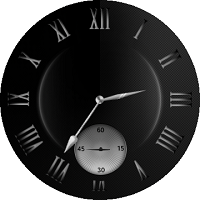
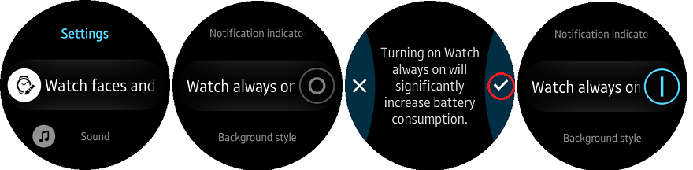

# AmbientWatch #

The AmbientWatch application demonstrates how to make a watch application that supports ambient mode in Tizen wearable device.
To extend battery life, a watch application can display a limited UI in ambient mode by detecting ambient mode changes.

   

* In ambient mode


 

First of all, "ambient-support" attribute should be set to true as follows:

 <watch-application appid="org.tizen.example.AmbientWatch" exec="AmbientWatch.dll" ambient-support="true" type="dotnet">
 </watch-application>

And then you need to overwrite OnAmbientChanged() and OnAmbientTick() methods.

You should add `alarm.set` privilege to get OnAmbientTick event in ambient mode.


  ```
    <privileges>
        <privilege>http://tizen.org/privilege/alarm.set</privilege>
    </privileges>
  ```

To use the ambient mode, you must enable it in Settings application.
  Launch "Settings" App -> Select "Watch faces and styles" -> Choose "Watch always on" -> Enable it

 


In addition, the ambient mode activates only when you are wearing a watch on your wrist.

You can get details about ambient-support attribute from https://docs.tizen.org/application/tizen-studio/native-tools/manifest-text-editor#manifest-elements

