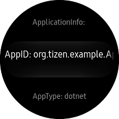

# AppInformation #

AppInformation sample app demonstrates how to get application-specific information(e.g. AppId, Package ID, shared directory path) and directory information(resource, cache, app data and etc).

This application uses Tizen.Application API.

* [Class ApplicationInfo](https://samsung.github.io/TizenFX/stable/api/Tizen.Applications.ApplicationInfo.html)
* [Class DirectoryInfo](https://samsung.github.io/TizenFX/stable/api/Tizen.Applications.DirectoryInfo.html)

In addition, there is a similar native sample application.
- [Tizen Native version](https://docs.tizen.org/development/sample/native/AppFW/App-common)

