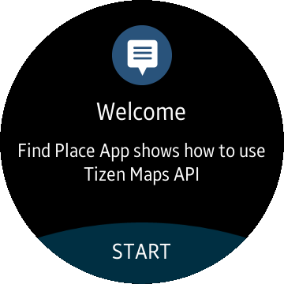
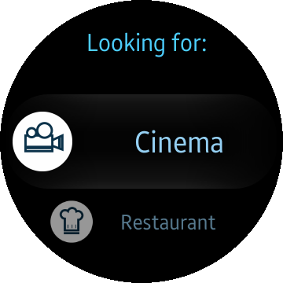
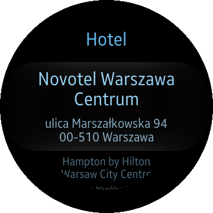

# FindPlace
FindPlace is a sample application which demonstrates how to use Tizen.CircularUI NuGet package and MapService class from TizenFX API.

### Features
* Place types list can be scrolled with bezel.
* Location is found using GPS.
* Places are found using Tizen Map Service.

### Prerequisites
* [Visual Studio](https://www.visualstudio.com/) - Buildtool, IDE
* [Visual Studio Tools for Tizen](https://docs.tizen.org/application/vstools/install) - Visual Studio plugin for Tizen .NET application development

### Author
* Piotr Konowrocki
